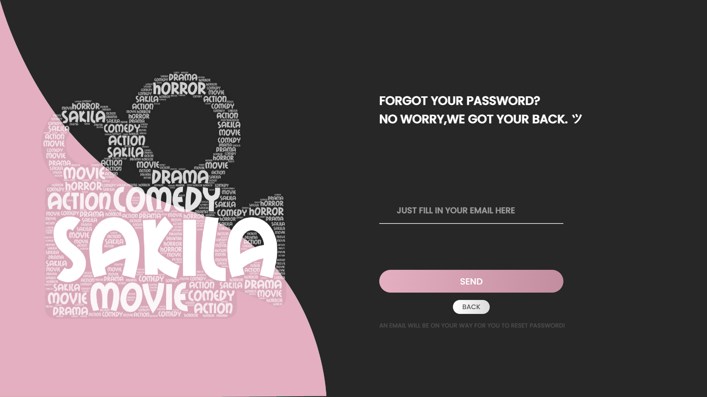
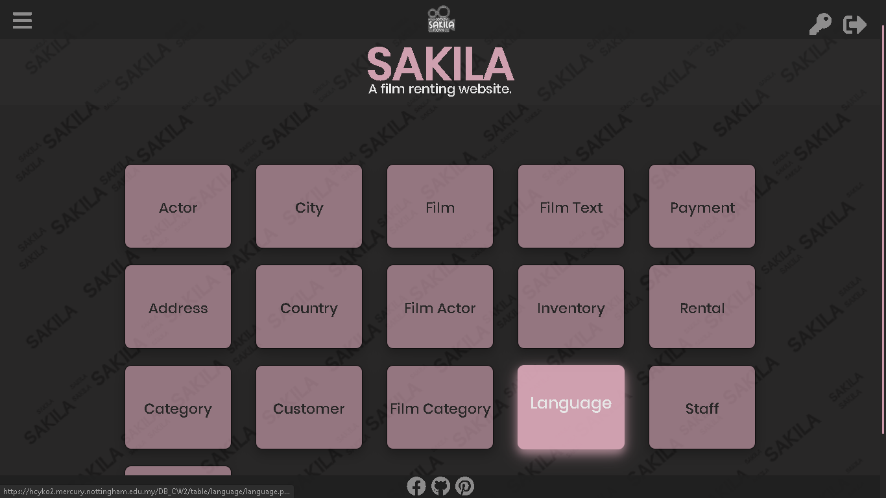
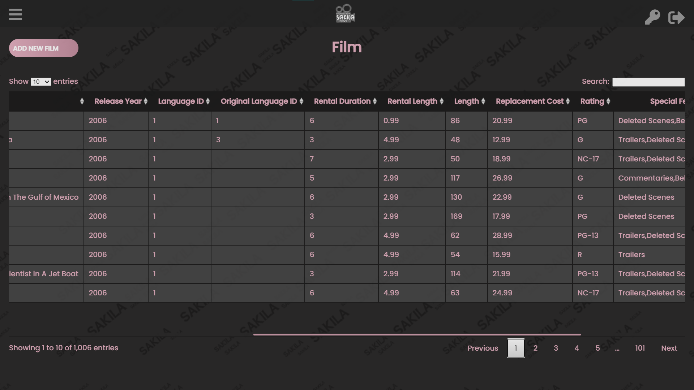
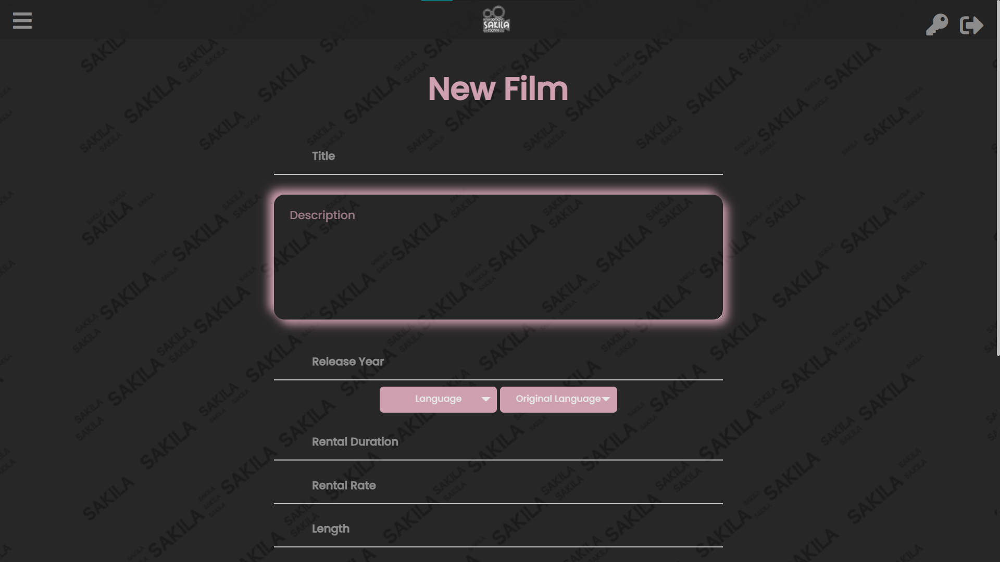
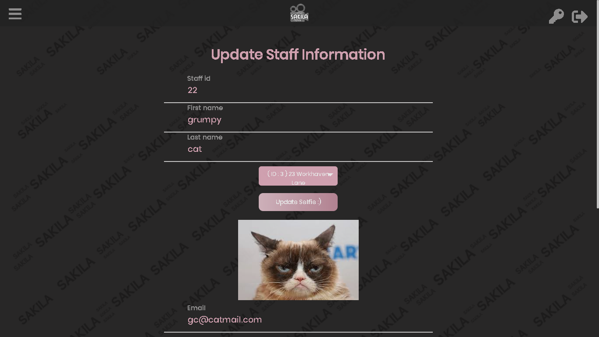
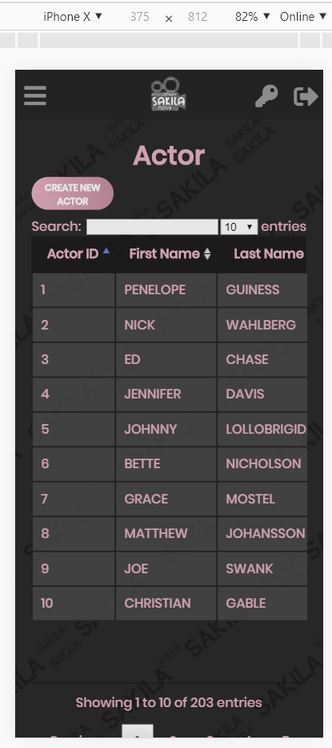
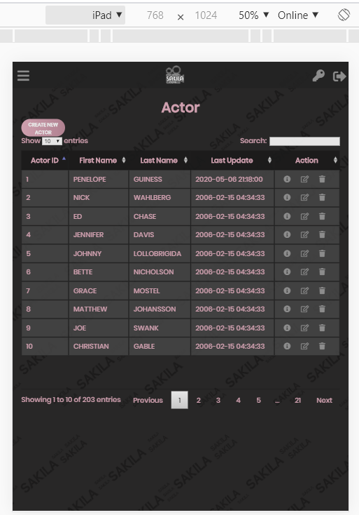

# Sakila website - Film inventory system
  
database and interface coursework where we create a simple website for existing dummy database to performs data manipulating operations.
A simple website mimicking a file store website.
Technology used for the implementation are html, php, css, sql, js, etc.   

# Screenshots

  
  

  
  

  
  

  
  

  
  

