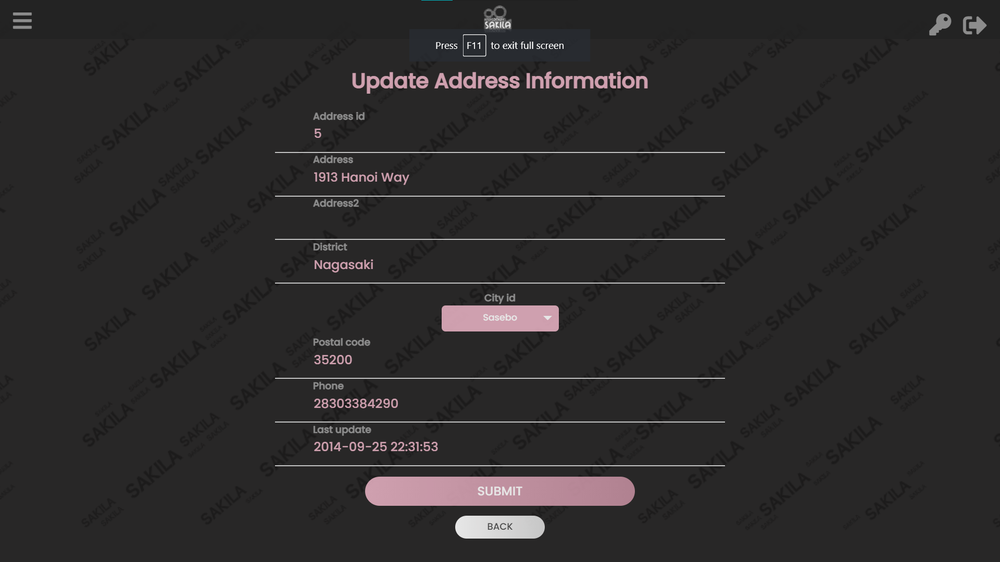

# Sakila website - Film inventory system
  
database and interface coursework where we create a simple website for existing dummy database to performs data manipulating operations.   
The implementation are related to html, php, css, sql, js, etc.   

# Screenshots

  
  
  
  

  
  
  
  

  
  
  
  

